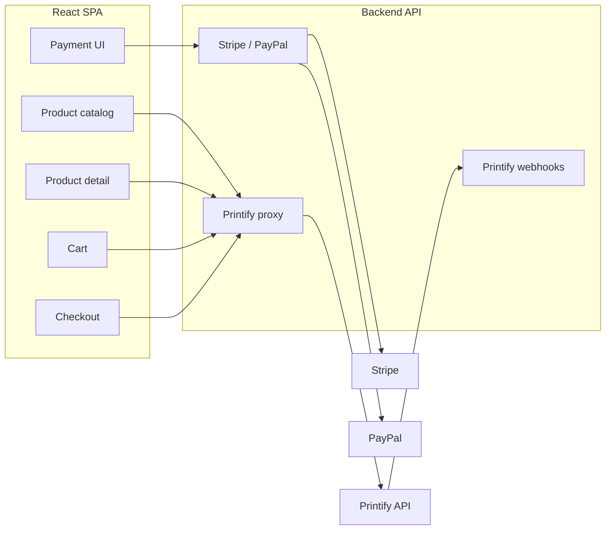

# Printify custom client and React SPA integration

## API summary (from [printify-open-api-spec.json](printify-integration/printify-open-api-spec.json))

- **Catalog**: read-only blueprints, print providers, variants, shipping (GET). Used for creating products in Printify dashboard; for the **public storefront** we use **Products** (your shop's products).
- **Products**: `GET /v1/shops/{shop_id}/products.json` (paginated), `GET .../products/{product_id}.json` — id, title, description, tags, options, variants (id, sku, cost, etc.).
- **Orders**: `POST .../orders.json` (submit order), `POST .../orders/shipping.json` (calculate shipping). Request: `line_items` (product_id, variant_id, quantity), `address_to` (first_name, last_name, email, phone, country, region, address1, address2, city, zip), optional shipping_method.
- **Auth**: Bearer token only; all requests must be server-side (token must not be exposed in the SPA).
- **Gaps**: No checkout, cart, or payment in Printify. Checkout flow and Stripe/PayPal must be implemented in your app; after successful payment the backend submits the order to Printify.

---

## Architecture

- **Inventory**: Managed in Printify (dashboard); no auth/storage for inventory on your side.
- **Public flow**: User browses catalog (shop products) and product details, adds to cart, goes to checkout (address + shipping), pays via Stripe or PayPal; backend then submits order to Printify and returns confirmation.

---

## 1. Backend: Netlify Functions

The app is currently frontend-only (package.json has no server). The backend is implemented as **Netlify Functions** under `netlify/functions/`:

- Keep the Printify Bearer token, shop ID, Stripe secrets, PayPal secrets, and any other sensitive values **server-side only** — never expose them to the client.
- **Secrets**: All tokens, passwords, and API keys (Printify API key, Stripe secret key, PayPal client secret, webhook signing secrets, etc.) are stored as **Netlify project-scope environment variables** (Site settings → Environment variables). Do not commit them; do not use `docs/` or repo files for production secrets (e.g. printify-integration/store-id.txt and api-key.txt are for local reference only).
- Each function reads from `process.env` (e.g. `process.env.PRINTIFY_TOKEN`, `process.env.STRIPE_SECRET_KEY`). Netlify injects project env vars into the function runtime.
- Proxy all Printify calls (products, product by id, calculate shipping, submit order) and handle payment creation and webhooks as serverless functions.

---

## 2. Printify custom client

Implement a **Printify API client** used only on the backend:

- **Base**: `https://api.printify.com`, `Authorization: Bearer <token>`, `Content-Type: application/json`.
- **Endpoints to implement** (from spec):
  - **Products**: `GET /v1/shops/{shop_id}/products.json` (query: `limit`, `page`), `GET .../products/{product_id}.json`.
  - **Shipping**: `POST /v1/shops/{shop_id}/orders/shipping.json` — body: `calculateShippingRequest` (line_items, address_to); returns `shippingCosts` (standard, express, priority, economy, printify_express — amounts in cents).
  - **Orders**: `POST /v1/shops/{shop_id}/orders.json` — body: `submitOrderRequest` (line_items, address_to, shipping_method, etc.); returns `orderCreated` (id).

Client can be a small class or set of functions that take `shopId` and `token` (from `process.env` in Netlify Functions: `PRINTIFY_SHOP_ID`, `PRINTIFY_TOKEN`), and expose methods such as: `listProducts(limit, page)`, `getProduct(productId)`, `calculateShipping(body)`, `submitOrder(body)`.

---

## 3. Backend API: Netlify Functions (proxy + payments)

Implement each API surface as a **Netlify Function** in `netlify/functions/`. Netlify will expose them under `/.netlify/functions/<name>` (or under a rewrite like `/api/*` if configured in `netlify.toml`).

- **Proxy functions** (call Printify client, return JSON):
  - `GET /.netlify/functions/products` (or `GET /api/products`) → list shop products (paginated).
  - `GET /.netlify/functions/product` (or `GET /api/products/:id`) → single product; pass `id` via query or path depending on redirect config.
  - `POST /.netlify/functions/orders-shipping` (or `POST /api/orders/shipping`) → forward to Printify calculate shipping; return shipping options/costs.
  - `POST /api/orders` (submit) → **do not** expose a public "submit order" handler; call Printify submit only from inside payment webhook handlers after successful payment.
- **Payment flow**:
  - **Create checkout session**: endpoint that accepts cart (line_items with product_id, variant_id, quantity), shipping option, address_to, and (optionally) total. Create a Stripe Checkout Session or PayPal order with that amount and metadata (e.g. cart + address + shipping_method).
  - **Success/cancel URLs**: redirect to your SPA (e.g. `/store/checkout/success`, `/store/checkout/cancel`).
  - **Webhook** (Stripe and/or PayPal): on successful payment, read metadata, build `submitOrderRequest` (line_items, address_to, shipping_method), call Printify client `submitOrder()`, then respond 200. Optionally store Printify order id in your DB or send in confirmation email.
  - **Optional**: Idempotency (e.g. `external_id` in submitOrder) to avoid duplicate Printify orders if webhook retries.
- **Environment**: All sensitive values live in **Netlify project-scope environment variables**, e.g. `PRINTIFY_TOKEN`, `PRINTIFY_SHOP_ID`, `STRIPE_SECRET_KEY`, `STRIPE_WEBHOOK_SECRET`, `PAYPAL_CLIENT_ID`, `PAYPAL_CLIENT_SECRET`, `PAYPAL_WEBHOOK_ID` (or equivalent). Configure them in Netlify dashboard (Site → Environment variables); never commit them to the repo.

---

## 4. Frontend (React SPA) — work breakdown

### 4.1 Product catalog

- **Route**: e.g. `/store` or `/store/:language` (align with existing pattern like App.jsx `/courses/:language`).
- **Data**: Fetch from your backend `GET /api/products` (paginated). Each item: id, title, description, images (from product.variants or product.images if present in spec), first variant or min price for display.
- **UI**: Grid of product cards (image, title, price range or min price). Reuse existing patterns (e.g. Catalog.jsx layout, CourseCard-style card) but for products; link to product detail page.
- **Store section**: Update Store.jsx to link to the new store route (or open catalog) instead of only opening StorePopup.jsx. Decide whether StorePopup remains for "license" and store becomes "merchandise" or merge flows.

### 4.2 Product detail page (PDP)

- **Route**: e.g. `/store/product/:id` (and optionally `/:language`).
- **Data**: `GET /api/products/:id` — variants, options (size, color, etc.), images.
- **UI**: Image(s), title, description, variant selector (options → variant_id), quantity, "Add to cart". Use variant's price (and sku if needed for display).

### 4.3 Cart

- **State**: Context or global state (e.g. React context or small store) for line items: `{ product_id, variant_id, quantity, title, price, image? }`. Persist in `localStorage` if you want cart to survive refresh.
- **UI**: Cart drawer or page; list items, update quantity, remove; show subtotal; link to checkout.

### 4.4 Checkout

- **Route**: e.g. `/store/checkout`.
- **Steps**:
  1. **Address**: Form collecting `address_to` (first_name, last_name, email, phone, country, region, address1, address2, city, zip). Validate required fields.
  2. **Shipping**: Call `POST /api/orders/shipping` with cart line_items and address_to; display shipping options (standard, economy, etc.) with costs; user selects one (store `shipping_method` and cost).
  3. **Order summary**: Subtotal + shipping; total used for payment.
  4. **Payment**: Button(s) "Pay with Stripe" / "Pay with PayPal" that call your backend "create checkout session" endpoint; redirect to Stripe Checkout or PayPal approval flow.

### 4.5 Post-payment

- **Success**: Redirect to `/store/checkout/success` (or `/thanks/:language` if you reuse ThanksPage); show confirmation and clear cart.
- **Cancel**: Redirect to `/store/checkout/cancel` and keep cart.

### 4.6 i18n and nav

- Add translations for store, product, cart, checkout, payment (reuse i18n.js and existing keys pattern).
- Add "Store" in header/nav to reach `/store` (already present in Catalog and Page via Store and StorePopup).

---

## 5. Gaps and payment plan

| Gap          | Resolution                                                                                                                                                       |
| ------------ | ---------------------------------------------------------------------------------------------------------------------------------------------------------------- |
| **Checkout** | Implement in SPA + backend: address form, shipping calculation via Printify, then payment (Stripe/PayPal).                                                       |
| **Cart**     | In-memory + optional localStorage; no Printify cart API.                                                                                                         |
| **Payment**  | Backend: Stripe Checkout (or Stripe Elements) and/or PayPal Orders API. On payment success (webhook), submit order to Printify with `POST .../orders.json`.      |
| **PayPal**   | Use PayPal REST API (Orders v2): create order with amount from cart+shipping, capture on approval; webhook or return URL to confirm and then submit to Printify. |
| **Stripe**   | Use Checkout Session or Payment Intents; webhook `checkout.session.completed` or `payment_intent.succeeded` to submit order to Printify.                         |

Recommendation: implement **Stripe first** (simpler webhook and redirect flow), then add **PayPal** as a second option.

---

## 6. Optional: Printify webhooks

- **Backend**: Register webhook with Printify for `order:created`, `order:sent-to-production`, `order:shipment:created`, `order:shipment:delivered` (and optionally product events).
- **Use**: Persist order status (e.g. by Printify order id or external_id) so you can show "Order shipped" / "Delivered" in a simple order status page or email. Not required for MVP.

---

## 7. File and structure sketch

- **Backend** (Netlify Functions in `netlify/functions/`):
  - Shared: `netlify/functions/lib/printifyClient.js` (or `_shared/printifyClient.js`) — Printify API client used by other functions. Reads `process.env.PRINTIFY_TOKEN` and `process.env.PRINTIFY_SHOP_ID` (from Netlify project env vars).
  - Functions: `products.js`, `product.js`, `orders-shipping.js`, `create-checkout-session.js`, `stripe-webhook.js`, `paypal-webhook.js` (and optionally `printify-webhook.js`). Each exports a `handler` for the serverless event; webhook handlers call the Printify client to submit the order after payment success.
  - Optional: `netlify.toml` with redirects/rewrites so the SPA can call `/api/products`, `/api/orders/shipping`, etc., which proxy to the corresponding functions.
- **Frontend** (existing `src/`):
  - `src/pages/Store/` or `src/components/Store/`: Product list, ProductDetail, Cart, Checkout, CheckoutSuccess, CheckoutCancel.
  - Cart context or store.
  - New routes in App.jsx for `/store`, `/store/product/:id`, `/store/checkout`, `/store/checkout/success`, `/store/checkout/cancel`.
- **Secrets**: All tokens, API keys, and webhook secrets are stored only in **Netlify project-scope environment variables**; keep `docs/printify-integration/` for the API spec and non-secret notes only (remove or ignore api-key.txt/store-id.txt in production).

---

## 8. Implementation order (suggested)

1. Backend: Printify client + proxy (products list, product by id, calculate shipping, submit order).
2. Backend: Stripe (create session, webhook, submit Printify order on success).
3. Frontend: Product catalog and product detail page, add to cart (state + optional localStorage).
4. Frontend: Cart page/drawer.
5. Frontend: Checkout (address → shipping → payment redirect); success/cancel pages.
6. (Optional) PayPal; (optional) Printify webhooks and order status.

This keeps inventory and fulfillment on Printify, and implements a clear work breakdown for catalog, cart, checkout, and payments (Stripe, then PayPal) in your React SPA and new backend.
